<p align="center">
  
</p>

<h1 align="center">🚦Traffic Sign Recognition: A Journey Through CNN & ViT Architectures </h1>

<p align="center">
  <a href="https://www.python.org/downloads/"></a>
  <a href="https://www.tensorflow.org/"></a>
  <a href="LICENSE"></a>
</p>

<p align="center">
  <em>Implementation and comparison of 5 CNN architectures (LeNet, AlexNet, VGG, GoogLeNet, ResNet) and Vision Transformer (attention-based) for German traffic sign classification</em>
</p>


## 📋 Table of Contents

- [Overview](#-overview)
- [Dataset](#-dataset)
- [Models](#-models)
- [Usage](#-usage)
- [Key Insights](#-key-insights)
- [Learning Resources](#-learning-resources)
- [License & Citation](#-license--citation)


## 🎯 Overview

This project reconstructs the evolution of Computer Vision through six architectures, specifically adapted for small-scale inputs (30x30): 
- **v1 (LeNet-style)** modernizes the classic baseline by replacing the original Sigmoid activations and Average Pooling with **ReLU and MaxPooling(which is good at saving features and edges)**. And we also use **drop out** to prevent overfiting;
- **v2 (AlexNet-style)** adopts deep feature extraction but discards large 11x11 kernels in favor of efficient **3x3 filters** and replaces LRN(effect was found to be mediocre) with **Drop out**, also implements **CONV blocks(CONV->ReLU->CONV->ReLU->drop out-> max pooling)**, which reduce the numbers of params and expand the Receptive Field;
- **v3 (VGG-style)** miniaturizes the deep structure into three uniform blocks but crucially adds **Batch Normalization** to ensure training stability, uses `padding = 'same'` to extract features without reducing sizes;
- **v4 (GoogLeNet-style)** simplifies the massive original network into just **two Inception modules** with **Global Average Pooling** to maximize parameter efficiency, owing to BN and shallow network, **Auxiliary Classifiers** are removed;
- **v5 (ResNet-style)** implements authentic residual learning with projection shortcuts but incorporates **Dropout**—absent in the original—to prevent overfitting on small datasets. We also implement `Conv->BN->ReLU->Conv->Bn->Add->ReLu` BasicBlocks, `1x1 Convolutional Projection` and `Stride = 2 `; 
- **v6 (Vision Transformer)** re-engineers ViT for low resolution by shrinking the standard 16x16 patch size to **5x5**, allowing the model to effectively learn global relationships on tiny images. 


## 📊 Dataset

### German Traffic Sign Recognition Benchmark (GTSRB)

- **43 classes** of traffic signs
- **26,640 images** (30×30 RGB)
- **Real-world challenge:** Small images, limited data, high variability

<p align="center">
  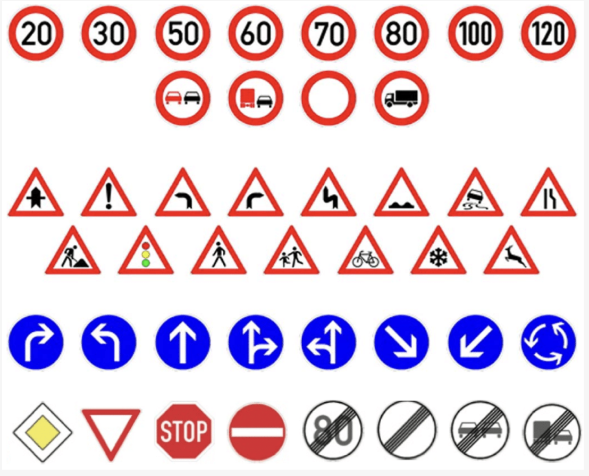
  <br/>
  <em>Sample images from the German Traffic Sign Recognition Benchmark (GTSRB) dataset</em>
</p>

**Data Split:**

- Training: 60% (~16,000 images)
- Testing: 40% (~10,600 images)


## 🏗️ Models

### Quick Comparison

| Model              | Year | Params | Accuracy | 
| ------------------ | ---- | ------ | -------- | 
| **V1: LeNet <- ReLU, MaxPooling, Drop out**      | 1998 | 809K   | 96.9%    | 
| **V2: AlexNet <- 3x3 kernel, CONV blocks, Drop out** ⭐ | 2012 | 612K   | 99.5%    | 
| **V3: VGG <- Batch Normalization**        | 2014 | 1.0M   | 99.3%    |
| **V4: GoogLeNet <- GAP, Inception Module, no Auxidiary Classifiers**  | 2014 | 148K   | 95.8%    | 
| **V5: ResNet <- basic blocks, stride**     | 2015 | 744K   | 95.7%    | 
| **V6: ViT <- Pos Embed, low learning rate Adam**        | 2020 | 160K   | 92.6%    | 


### V1: Basic CNN (LeNet-inspired)

<details>
<summary><b>Click to expand</b></summary>

#### Architecture Diagram

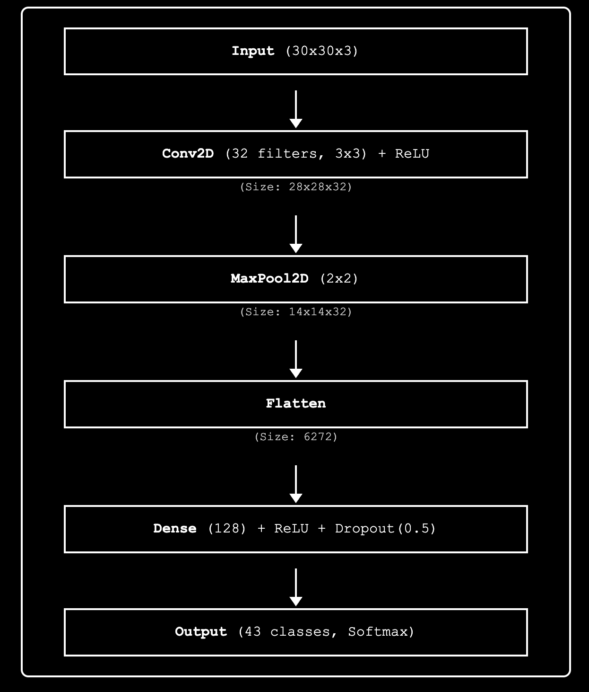

#### Architecture Flow

```
Input (30×30×3) → Conv2D(32) → MaxPool → Flatten → Dense(128) → Dense(43)
```

#### Parameter Breakdown

```
Layer                    Output Shape      Params      % of Total
─────────────────────────────────────────────────────────────────
Conv2D                   (28, 28, 32)      896         0.1%
MaxPooling2D             (14, 14, 32)      0           0.0%
Flatten                  (6272)            0           0.0%
Dense                    (128)             802,944     99.3%  ← Bottleneck!
Dropout                  (128)             0           0.0%
Dense (Output)           (43)              5,547       0.6%
─────────────────────────────────────────────────────────────────
Total                                      809,387     100%
```

#### Training Results

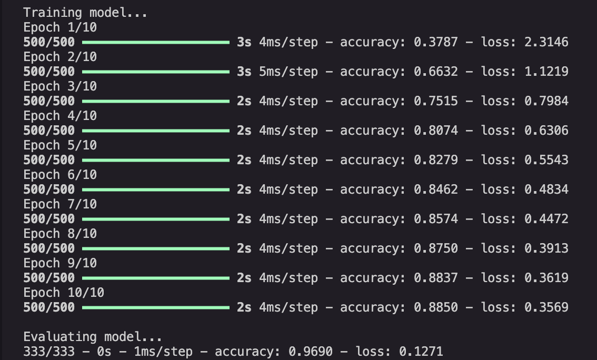

#### Reference Architecture: LeNet-5 (1998)

**Original LeNet-5:**

- Designed for 32×32 grayscale MNIST digits
- Used tanh activation and average pooling
- 5×5 convolutional kernels
- ~60K parameters

**Our Adaptations:**

- ✅ **ReLU activation** instead of tanh (6x faster convergence)
- ✅ **MaxPooling** instead of AveragePooling (better feature selection)
- ✅ **Dropout regularization** (not in original, prevents overfitting)
- ✅ **Smaller kernels** (3×3 vs 5×5, fewer parameters)
- ✅ **RGB input** (3 channels vs 1 grayscale)
- ✅ **Adapted for 30×30 images** (vs 32×32)

**Key Limitation:** 99% of parameters in fully connected layers creates a bottleneck and limits feature learning capacity.

</details>


### V2: Improved CNN (AlexNet-inspired)

<details>
<summary><b>Click to expand</b></summary>

#### Architecture Diagram

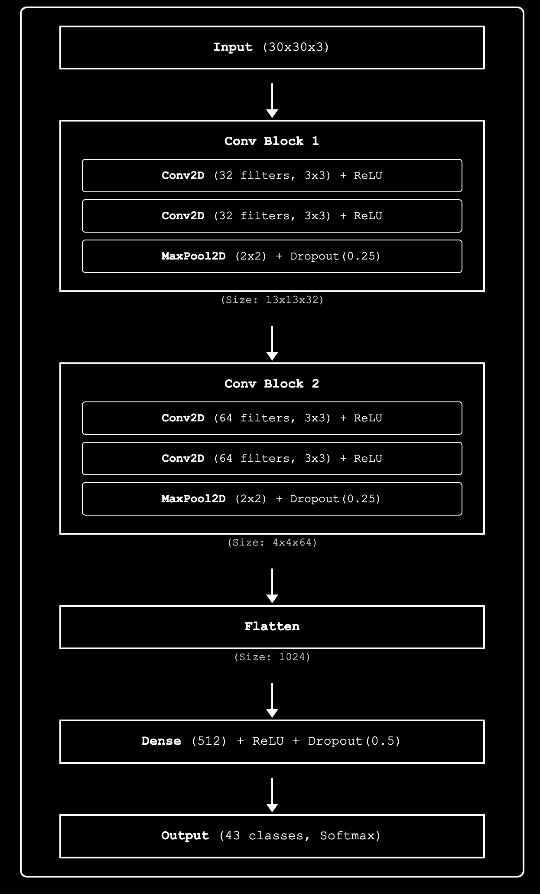

#### Architecture Flow

```
Input → [Conv(32)×2 → Pool → Dropout]×2 → Flatten → Dense(512) → Dense(43)
```

#### Parameter Breakdown

```
Layer                    Output Shape      Params      % of Total
─────────────────────────────────────────────────────────────────
Conv2D (Block 1)         (28, 28, 32)      896         0.1%
Conv2D (Block 1)         (26, 26, 32)      9,248       1.5%
MaxPooling2D             (13, 13, 32)      0           0.0%
Dropout                  (13, 13, 32)      0           0.0%
Conv2D (Block 2)         (11, 11, 64)      18,496      3.0%
Conv2D (Block 2)         (9, 9, 64)        36,928      6.0%
MaxPooling2D             (4, 4, 64)        0           0.0%
Dropout                  (4, 4, 64)        0           0.0%
Flatten                  (1024)            0           0.0%
Dense                    (512)             524,800     85.7%  ← Still dominant
Dropout                  (512)             0           0.0%
Dense (Output)           (43)              22,059      3.6%
─────────────────────────────────────────────────────────────────
Total                                      612,427     100%
```

#### Training Results

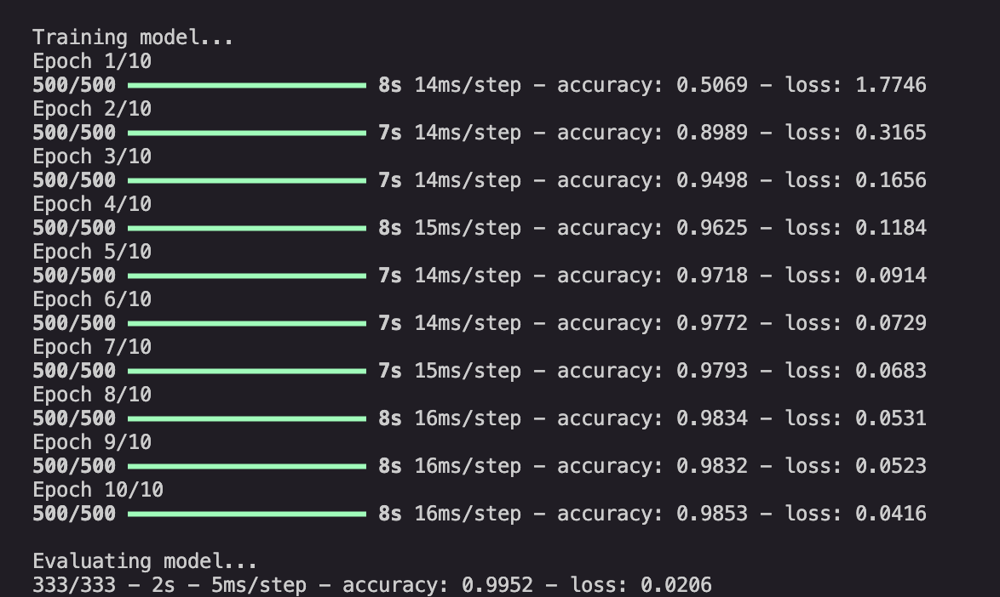

**Test Accuracy:** 99.52% ⭐ (Highest among all models)  
**Training Time:** ~1.5 minutes  
**Epochs:** 10

#### Reference Architecture: AlexNet (2012)

**Original AlexNet:**

- Designed for 224×224 ImageNet images
- 5 convolutional layers + 3 fully connected layers
- 11×11 and 5×5 large kernels
- ~60M parameters
- First to use ReLU and Dropout

**Our Adaptations:**

- ✅ **Smaller filters** (3×3 vs 11×11, 5×5) → 90% fewer parameters
- ✅ **Fewer layers** (4 conv vs 5) → adapted for small images
- ✅ **No Local Response Normalization** → simpler, modern approach
- ✅ **Filter progression** (32→64 vs 96→256) → scaled for dataset size
- ✅ **99% parameter reduction** (612K vs 60M) while maintaining effectiveness

**Key Improvement over V1:** Stacked convolutions create hierarchical features - early layers detect edges, later layers detect shapes and patterns.

</details>


### V3: VGG-style Deep Network

<details>
<summary><b>Click to expand</b></summary>

#### Architecture Diagram

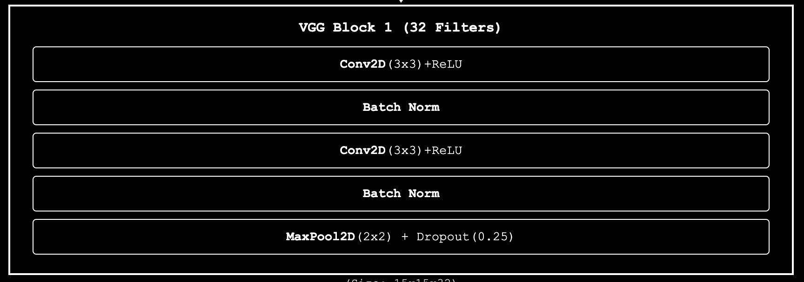

#### Architecture Flow

```
Input → [Conv(32)×2+BN → Pool]×3 → Dense(512) → Dense(256) → Dense(43)
        Block1: 32 filters
        Block2: 64 filters
        Block3: 128 filters
```

#### Parameter Breakdown

```
Layer                    Output Shape      Params      % of Total
─────────────────────────────────────────────────────────────────
                     Block_1(Filters: 32)
conv2d_1-1               (30, 30, 32)      896         0.1%
batch_normalization_1-1  (30, 30, 32)      128         0.0%
conv2d_1-2               (30, 30, 32)      9,248       0.9%
batch_normalization_1-2  (30, 30, 32)      128         0.0%
max_pooling2d            (15, 15, 32)      0           0.0%
dropout                  (15, 15, 32)      0           0.0%

                     Block_2(Filters: 64)
conv2d_2-1               (15, 15, 64)      18,496      1.8%
batch_normalization_2-1  (15, 15, 64)      256         0.0%
conv2d_2-2               (15, 15, 64)      36,928      3.6%
batch_normalization_2-2  (15, 15, 64)      256         0.0%
max_pooling2d            (7, 7, 64)        0           0.0%
dropout                  (7, 7, 64)        0           0.0%

                     Block_3(Filters: 128)
conv2d_3-1               (7, 7, 128)       73,856      7.2%
batch_normalization_3-1  (7, 7, 128)       512         0.1%
conv2d_3-2               (7, 7, 128)       147,584     14.4%
batch_normalization_3-2  (7, 7, 128)       512         0.1%
max_pooling2d            (3, 3, 128)       0           0.0%
dropout                  (3, 3, 128)       0           0.0%

flatten                  (1152)            0           0.0%
dense                    (512)             590,336     57.6%  ← Largest
batch_normalization      (512)             2,048       0.2%
dropout.                 (512)             0           0.0%
dense                    (256)             131,328     12.8%
batch_normalization      (256)             1,024       0.1%
dropout.                 (256)             0           0.0%
dense (Output)           (43)              11,051      1.1%
─────────────────────────────────────────────────────────────────
Total                                      1,024,587   100%
```

#### Training Results

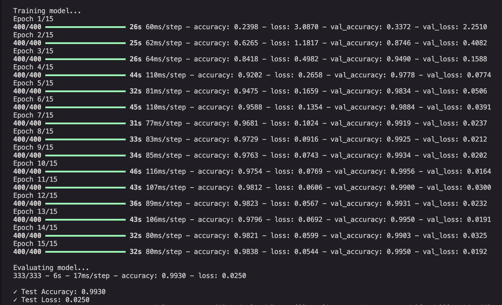

**Test Accuracy:** 99.30%  
**Training Time:** ~8 minutes  
**Epochs:** 15

#### Reference Architecture: VGG-16 (2014)

**Original VGG-16:**

- Designed for 224×224 ImageNet images
- 13 convolutional layers + 3 fully connected layers
- All 3×3 kernels (revolutionary simplicity)
- ~138M parameters
- Very deep for its time (16 layers)

**Our Adaptations:**

- ✅ **Added Batch Normalization** (not in original 2014 paper) → 2-3x faster training
- ✅ **Dropout after each block** (original only in FC layers) → better regularization
- ✅ **Smaller Dense layers** (512, 256 vs 4096, 4096) → adapted for task complexity
- ✅ **3 blocks instead of 5** → adapted for 30×30 images
- ✅ **padding='same'** → preserves spatial information longer
- ✅ **99% parameter reduction** (1.2M vs 138M)

**VGG's Key Innovation:** Stacking small 3×3 kernels is more efficient than large kernels:

- Two 3×3 convs = 5×5 receptive field (28% fewer parameters)
- Three 3×3 convs = 7×7 receptive field (45% fewer parameters)
- More non-linearity (more ReLU activations)

</details>


### V4: GoogLeNet/Inception-style

<details>
<summary><b>Click to expand</b></summary>

#### Architecture Diagram

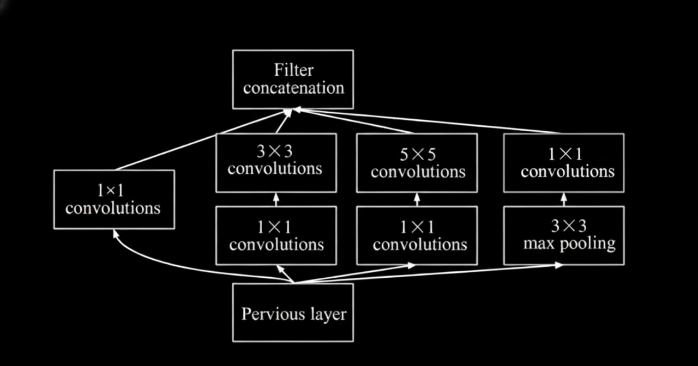

#### Architecture Flow

```
Input → Conv(32) → Pool → Inception1(72) → Pool → Inception2(144) → GAP → Dense(512) → Dense(43)
```

**Inception Module Structure:**

```
Input (15×15×32)
  ├─ Branch 1: 1×1 Conv (16 filters)
  ├─ Branch 2: 1×1 Conv (16) → 3×3 Conv (32)
  ├─ Branch 3: 1×1 Conv (8) → 5×5 Conv (16)
  └─ Branch 4: MaxPool → 1×1 Conv (8)
       ↓
  Concatenate → Output (15×15×72)
```

#### Parameter Breakdown

```
Layer                    Output Shape      Params      % of Total
─────────────────────────────────────────────────────────────────
conv2d (Initial)         (30, 30, 32)      896         0.6%
batch_normalization      (30, 30, 32)      128         0.1%
max_pooling2d            (15, 15, 32)      0           0.0%
Inception Module 1       (15, 15, 72)      13,896      9.4%
  ├─ conv2d_1 (1×1)      (15, 15, 16)      528
  ├─ conv2d_2 (1×1)      (15, 15, 16)      528
  ├─ conv2d_3 (1×1)      (15, 15, 8)       264
  ├─ conv2d_4 (3×3)      (15, 15, 32)      4,640
  ├─ conv2d_5 (5×5)      (15, 15, 16)      3,216
  ├─ max_pooling2d_1     (15, 15, 32)      0
  ├─ conv2d_6 (1×1)      (15, 15, 8)       264
  └─ concatenate         (15, 15, 72)      0
batch_normalization_1    (15, 15, 72)      288         0.2%
dropout                  (15, 15, 72)      0           0.0%
max_pooling2d_2          (7, 7, 72)        0           0.0%
Inception Module 2       (7, 7, 144)       42,928      29.0%
  ├─ conv2d_7 (1×1)      (7, 7, 32)        2,336
  ├─ conv2d_8 (1×1)      (7, 7, 32)        2,336
  ├─ conv2d_9 (1×1)      (7, 7, 16)        1,168
  ├─ conv2d_10 (3×3)     (7, 7, 64)        18,496
  ├─ conv2d_11 (5×5)     (7, 7, 32)        12,832
  ├─ max_pooling2d_3     (7, 7, 72)        0
  ├─ conv2d_12 (1×1)     (7, 7, 16)        1,168
  └─ concatenate_1       (7, 7, 144)       0
batch_normalization_2    (7, 7, 144)       576         0.4%
dropout_1                (7, 7, 144)       0           0.0%
global_avg_pooling2d     (144)             0           0.0%
dense                    (512)             74,240      50.2%  ← Largest
batch_normalization_3    (512)             2,048       1.4%
dropout_2                (512)             0           0.0%
dense_1 (Output)         (43)              22,059      14.9%
─────────────────────────────────────────────────────────────────
Total                                      148,011     100%
Trainable                                  146,491     (99.0%)
Non-trainable                              1,520       (1.0%)
```

#### Training Results

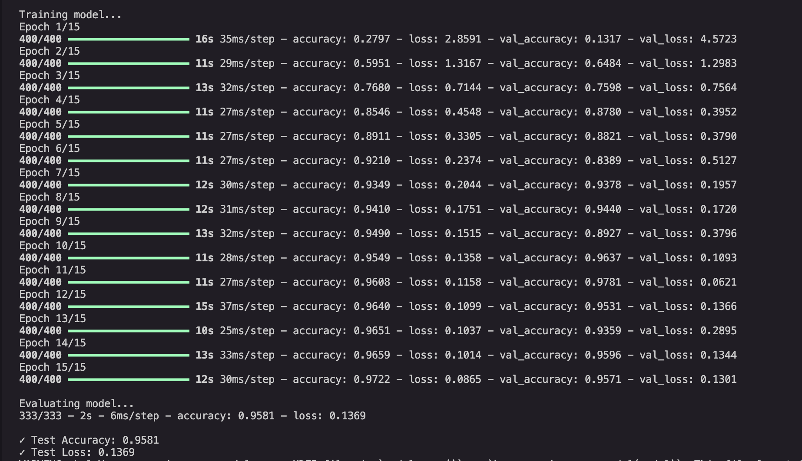

**Test Accuracy:** 95.81%  
**Training Time:** ~3 minutes  
**Epochs:** 15

#### Reference Architecture: GoogLeNet/Inception-v1 (2014)

**Original GoogLeNet:**

- Designed for 224×224 ImageNet images
- 9 Inception modules stacked
- 22 layers deep
- ~7M parameters (efficient for its time)
- Winner of ILSVRC 2014

**Our Adaptations:**

- ✅ **Only 2 Inception modules** (vs 9) → adapted for small images
- ✅ **Smaller filter counts** → scaled for dataset complexity
- ✅ **Added Batch Normalization** → stabilizes training
- ✅ **Global Average Pooling** → replaces large FC layers (98% parameter reduction)
- ✅ **94% parameter reduction** (400K vs 7M)

**Key Innovation - 1×1 Convolutions for Dimensionality Reduction:**

Without 1×1 reduction (naive):

```
Direct 3×3 conv: 32 → 32 filters = 3×3×32×32 = 9,216 params
Direct 5×5 conv: 32 → 16 filters = 5×5×32×16 = 12,800 params
Total: 22,016 parameters
```

With 1×1 reduction (Inception):

```
1×1 conv: 32 → 16 = 512 params
3×3 conv: 16 → 32 = 4,608 params
1×1 conv: 32 → 8 = 256 params
5×5 conv: 8 → 16 = 3,200 params
Total: 8,576 parameters (61% reduction!)
```

**Multi-scale Feature Extraction:** Parallel branches capture patterns at different scales simultaneously, making the network more robust to variations in object size.

</details>


### V5: ResNet-style ⭐ 

<details>
<summary><b>Click to expand</b></summary>

#### Architecture Diagram

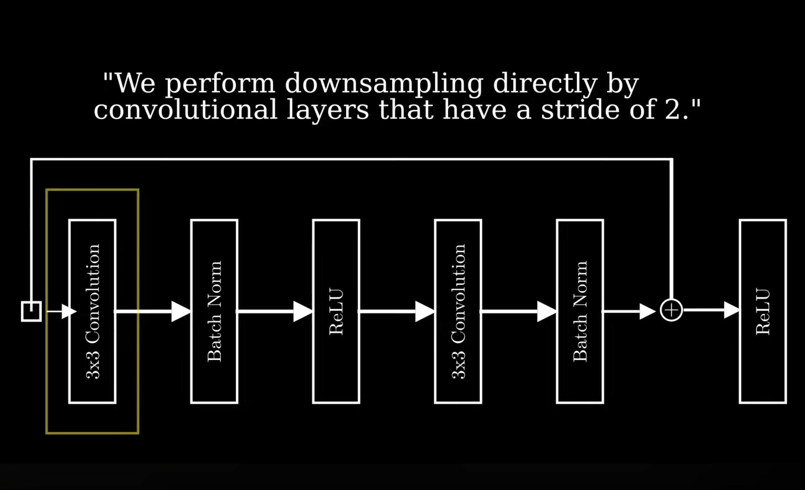 
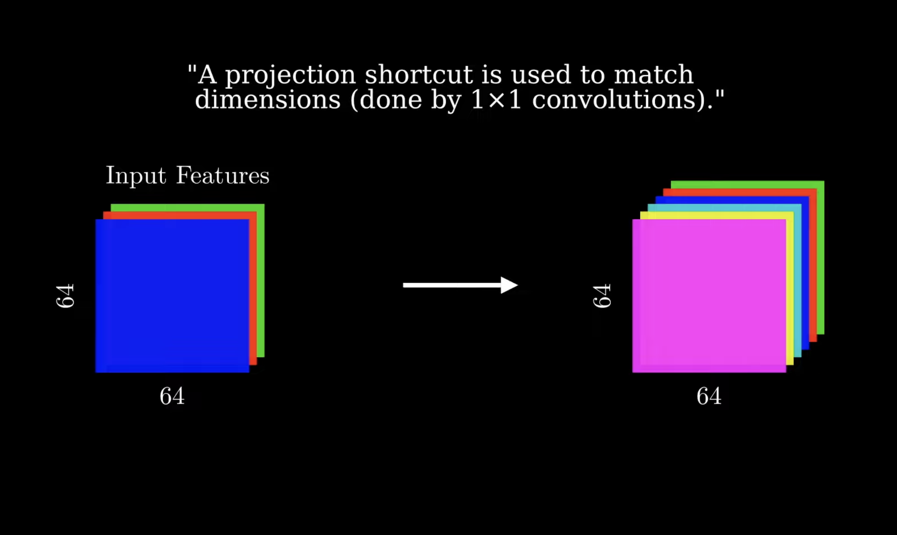

#### Architecture Flow

```
Input → Conv(32)+BN → [ResBlock(32)]×2 → [ResBlock(64)]×2 → [ResBlock(128)]×2
      → GAP → Dense(256) → Dense(43)
```

**Residual Block Structure:**

```
Input x (e.g., 15×15×64)
  ├─ Main Path: Conv → BN → ReLU → Conv → BN → F(x)
  └─ Skip Path: x (identity) or 1×1 Conv (if dimensions change)
       ↓
  Add: H(x) = F(x) + x
       ↓
  ReLU → Output
```

#### Parameter Breakdown

```
Layer                    Output Shape      Params      % of Total
─────────────────────────────────────────────────────────────────
Initial Conv + BN        (30, 30, 32)      1,024       0.1%
Stage 1: ResBlock×2      (30, 30, 32)      37,248      5.0%
  ├─ Conv 3×3            (30, 30, 32)      9,248
  ├─ Conv 3×3            (30, 30, 32)      9,248
  └─ Skip connection     identity          0
Stage 2: ResBlock×2      (15, 15, 64)      151,040     20.3%
  ├─ Conv 3×3 (stride=2) (15, 15, 64)      18,496
  ├─ Conv 3×3            (15, 15, 64)      36,928
  └─ Projection shortcut (15, 15, 64)      2,112
Stage 3: ResBlock×2      (8, 8, 128)       525,952     70.7%  ← Largest
  ├─ Conv 3×3 (stride=2) (8, 8, 128)       73,856
  ├─ Conv 3×3            (8, 8, 128)       147,584
  └─ Projection shortcut (8, 8, 128)       8,320
Global Avg Pooling       (128)             0           0.0%
Dense                    (256)             33,024      4.4%
Dense (Output)           (43)              11,051      1.5%
─────────────────────────────────────────────────────────────────
Total                                      743,787     100%
Trainable                                  741,035     (99.6%)
Non-trainable                              2,752       (0.4%)
```

#### Training Results

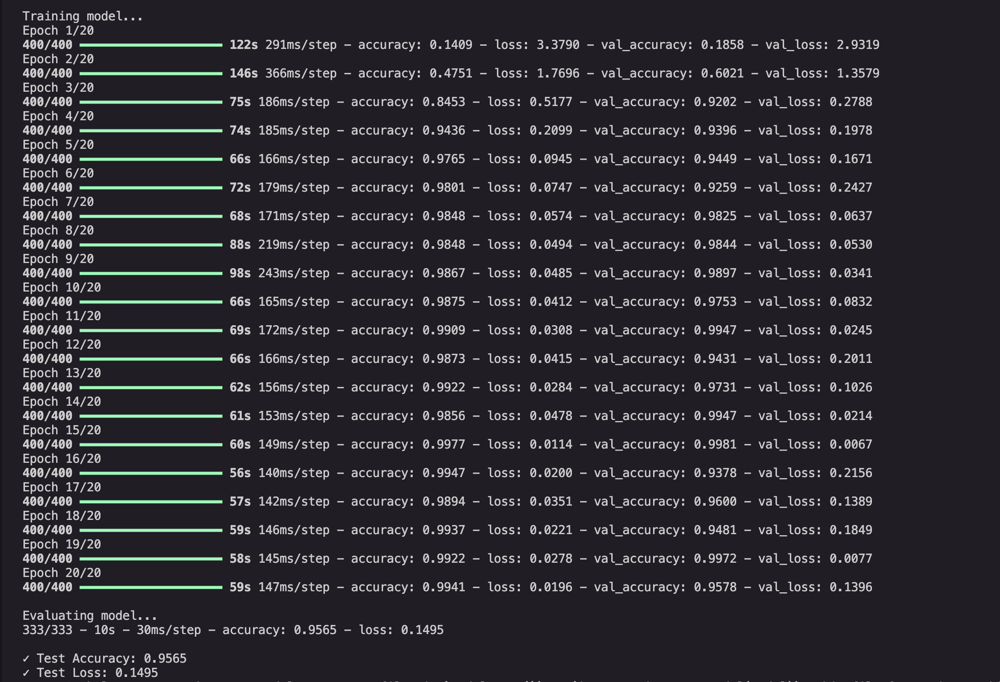

**Test Accuracy:** 95.65%  
**Training Time:** ~25 minutes  
**Epochs:** 20

#### Reference Architecture: ResNet-34 (2015)

**Original ResNet-34:**

- Designed for 224×224 ImageNet images
- 34 layers with residual connections
- ~21M parameters
- Solved the degradation problem (deeper ≠ worse)
- Winner of ILSVRC 2015

**Our Adaptations:**

- ✅ **3 stages instead of 4** → adapted for 30×30 images
- ✅ **2 blocks per stage** (vs 3-6) → scaled for dataset size
- ✅ **Smaller filter counts** (32→64→128 vs 64→128→256→512)
- ✅ **No initial 7×7 conv** → uses 3×3 for small images
- ✅ **96% parameter reduction** (800K vs 21M)

**Key Innovation - Residual Learning:**

**Problem:** Deep networks suffer from vanishing gradients

```
Traditional Network (20 layers):
Output (gradient = 1.0)
  ↓ ×0.9 (each layer)
Layer 20 → gradient = 0.9
Layer 19 → gradient = 0.81
Layer 18 → gradient = 0.73
  ...
Layer 1 → gradient ≈ 0.12  ← Vanishing!
```

**Solution:** Skip connections create "gradient highways"

```
ResNet (20 layers):
Output (gradient = 1.0)
  ↓
Layer 20: gradient flows through BOTH paths
  ├─ Main path: ×0.9 = 0.9
  └─ Skip path: ×1.0 = 1.0
  Total: 1.9  ← Gradient amplified!
  ↓
Layer 1: Still has strong gradient!
```

**Residual Learning Intuition:**

- Traditional: Learn H(x) directly (hard if H(x) ≈ x)
- ResNet: Learn F(x) = H(x) - x, then H(x) = F(x) + x
- If optimal H(x) ≈ x (identity), just learn F(x) ≈ 0 (easy!)

**Why ResNet Performs Well:**

1. Stable training with deep networks via skip connections
2. Strong accuracy (95.7%)
3. Proven architecture (widely used in production)
4. Parameters mainly in conv layers (efficient feature learning)

</details>


### V6: Vision Transformer

<details>
<summary><b>Click to expand</b></summary>

#### Architecture Diagram


#### Architecture Flow

```
Input (30×30×3) → Patch Embedding (36 patches) → +Positional Encoding
      → [Transformer Block]×3 → [CLS] Token → LayerNorm → Dense(43)
```

**Transformer Block Structure:**

```
Input
  ├─ LayerNorm → Multi-Head Self-Attention (4 heads) → Add (residual)
  └─ LayerNorm → MLP (Dense→GELU→Dense) → Add (residual)
       ↓
  Output
```

#### Parameter Breakdown

```
Layer                    Output Shape      Params      % of Total
─────────────────────────────────────────────────────────────────
Patch Embedding          (37, 64)          7,296       4.6%
  ├─ Linear projection   (36, 64)          4,608
  ├─ [CLS] token         (1, 64)           64
  └─ Positional encoding (37, 64)          2,624
Transformer Block 1      (37, 64)          49,984      31.2%
  ├─ Multi-Head Attn     (37, 64)          16,640
  ├─ LayerNorm           (37, 64)          128
  ├─ MLP                 (37, 64)          33,088
  └─ LayerNorm           (37, 64)          128
Transformer Block 2      (37, 64)          49,984      31.2%
Transformer Block 3      (37, 64)          49,984      31.2%
Classification Head      (43)              2,923       1.8%
  ├─ LayerNorm           (64)              128
  └─ Dense               (43)              2,795
─────────────────────────────────────────────────────────────────
Total                                      160,171     100%
```

#### Training Results

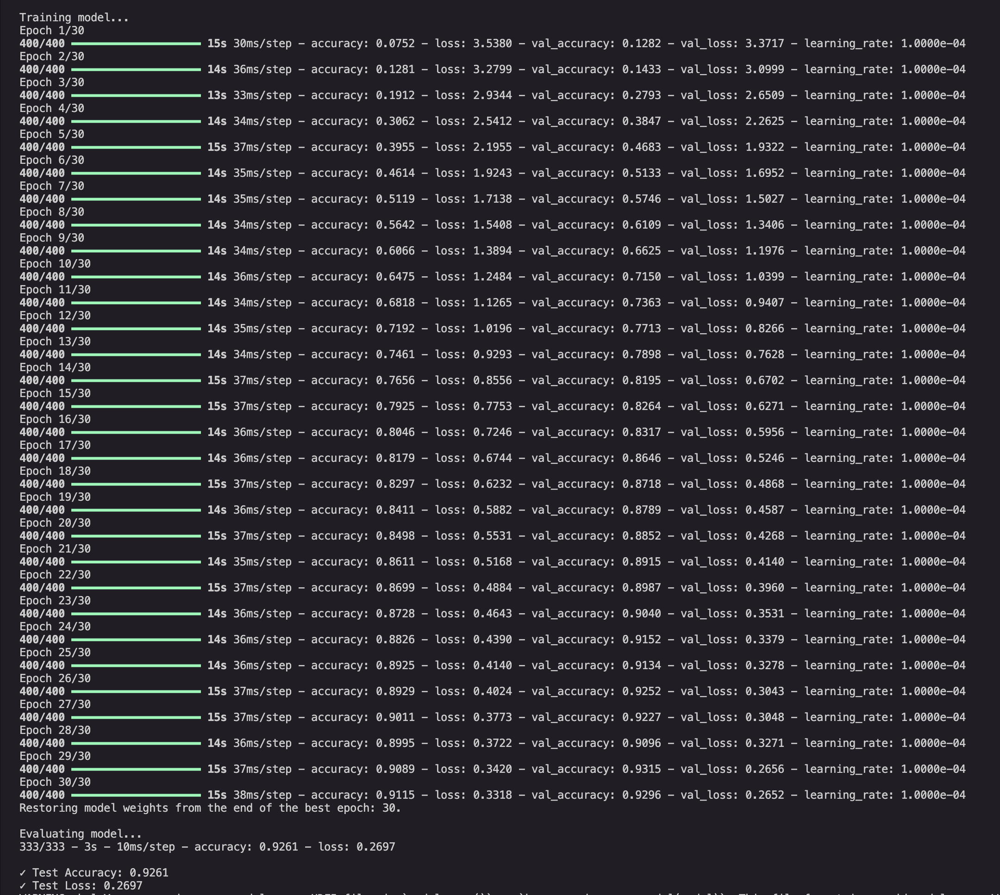

**Test Accuracy:** 92.61% ⚠️ (Lowest among all models)  
**Training Time:** ~7 minutes  
**Epochs:** 30

#### Reference Architecture: Vision Transformer (ViT) (2020)

**Original ViT:**

- Designed for 224×224 (or larger) ImageNet images
- 16×16 patches (196 patches for 224×224)
- 12 Transformer layers
- ~86M parameters (ViT-Base)
- Pre-trained on 300M images (JFT-300M dataset)

**Our Adaptations:**

- ✅ **5×5 patches** (vs 16×16) → 36 patches for 30×30 images
- ✅ **3 Transformer blocks** (vs 12) → scaled for dataset size
- ✅ **Smaller embedding** (64 vs 768) → adapted for task complexity
- ✅ **4 attention heads** (vs 12) → computational efficiency
- ✅ **99.5% parameter reduction** (400K vs 86M)

**Why ViT Underperforms on This Task:**

**1. No Inductive Bias:**

- **CNNs:** Built-in assumptions
  - Translation invariance (same pattern anywhere in image)
  - Locality (nearby pixels are related)
  - Hierarchical features (edges → shapes → objects)
- **ViT:** Learns everything from scratch
  - Needs to discover these properties from data
  - Requires massive datasets to learn basic visual concepts

**2. Data Requirements:**

```
Original ViT Training:
- Pre-training: 300M images (JFT-300M)
- Fine-tuning: 1.3M images (ImageNet)
- Total: 301M images

Our Dataset:
- Training: 16K images
- Ratio: 0.005% of original data ← 20,000x less data!
```

**3. Self-Attention is Data-Hungry:**

- Each patch attends to all other patches (global receptive field from layer 1)
- Flexible but needs data to learn meaningful attention patterns
- With limited data, attention patterns don't converge well

**4. Patch Size vs Image Size:**

```
Original ViT: 224×224 image → 16×16 patches = 196 patches
Our ViT: 30×30 image → 5×5 patches = 36 patches

Problem: Fewer patches = less spatial information
- Each patch is 6×6 pixels (very coarse)
- Hard to capture fine-grained details
```

**When ViT Would Excel:**

- ✅ Massive datasets (millions of images)
- ✅ Large images (224×224 or bigger)
- ✅ Transfer learning from pre-trained models
- ✅ Tasks requiring global context

**Key Insight:** This experiment demonstrates that **architectural innovations must match data availability**. ViT's flexibility is its strength with massive data, but becomes a weakness with limited data where CNNs' inductive biases provide crucial guidance.

</details>


## 💻 Usage

### Quick Start

```bash
# Clone repository
git clone https://github.com/AlexCao911/GTSRB-CNN-to-ViT.git
cd GTSRB-CNN-to-ViT

# Install dependencies
pip install -r requirements.txt

# Download GTSRB dataset (place in gtsrb/ directory)
# Dataset: https://benchmark.ini.rub.de/gtsrb_dataset.html
```

### Training Models

**Option 1: Train all models (recommended)**

```bash
make all
```

This will train all 6 models sequentially and save them as `model_v1.h5` through `model_v6.h5`.

**Option 2: Train specific models**

```bash
make train-v1-basic      # LeNet-inspired (2 min)
make train-v2-advanced   # AlexNet-inspired (5 min)
make train-v3-vgg        # VGG-style (8 min)
make train-v4-gln        # GoogLeNet-style (7 min)
make train-v5-res        # ResNet-style (10 min) ⭐
make train-v6-vit        # Vision Transformer (15 min)
```

**Option 3: Manual training**

```bash
python3 traffic/traffic_v5_resnet.py gtsrb model_v5.h5
```

**Clean up models:**

```bash
make clean  # Remove all .h5 files and cache
```


## 💡 Key Insights

### 1. "Newer" ≠ "Better"

Vision Transformer (2020) gets **92.6%** accuracy, while AlexNet (2012) achieves **99.5%** and VGG (2014) reaches **99.3%**.

**Why?** Inductive bias matters when data is limited.

- **CNNs:** Built-in assumptions (translation invariance, locality)
- **ViT:** Learns everything from scratch → needs massive data

### 2. Architecture Evolution

```
LeNet (1998)    → Proved CNNs work
AlexNet (2012)  → ReLU + Dropout + GPU = Deep Learning Revolution
VGG (2014)      → Depth + 3×3 kernels = Simplicity
GoogLeNet (2014)→ Width + 1×1 convs = Efficiency
ResNet (2015)   → Skip connections = Very deep networks ⭐
ViT (2020)      → Attention = No convolutions (with enough data)
```

### 3. Limitation
When classifying the little pictures and small data set, those CNNs implemented from scratch may have the best effect, however, when facing more complex classication tasks, it's supposed to take advantage of others‘ work like [End side] `moblieNet`, `YOLO`, [Industral grade]`ConvNeXt`, `Swin Transformer`, `EfficientNet`, [Multi Model] `CLIP`, `DINOv2`... 

## 📚 Learning Resources

### Papers Implemented

1. **LeNet-5** (1998) - LeCun et al.

   - [Gradient-Based Learning Applied to Document Recognition](http://yann.lecun.com/exdb/publis/pdf/lecun-01a.pdf)

2. **AlexNet** (2012) - Krizhevsky et al.

   - [ImageNet Classification with Deep CNNs](https://papers.nips.cc/paper/4824-imagenet-classification-with-deep-convolutional-neural-networks.pdf)

3. **VGG** (2014) - Simonyan & Zisserman

   - [Very Deep Convolutional Networks](https://arxiv.org/abs/1409.1556)

4. **GoogLeNet** (2014) - Szegedy et al.

   - [Going Deeper with Convolutions](https://arxiv.org/abs/1409.4842)

5. **ResNet** (2015) - He et al.

   - [Deep Residual Learning](https://arxiv.org/abs/1512.03385)

6. **Vision Transformer** (2020) - Dosovitskiy et al.
   - [An Image is Worth 16x16 Words](https://arxiv.org/abs/2010.11929)

### Recommended Reading

- **CS231n:** [Convolutional Neural Networks for Visual Recognition](http://cs231n.stanford.edu/)
- **Deep Learning Book:** [Goodfellow, Bengio, Courville](https://www.deeplearningbook.org/)
- **Dive into Deep Learning:** [d2l.ai](https://d2l.ai/)


## 📁 Project Structure

```
GTSRB-CNN-to-ViT/
├── README.md                    # This file
├── requirements.txt             # Python dependencies
├── makefile                     # Build automation
├── LICENSE                      # MIT License
│
├── refactored/                  # Redactored versions
├── traffic/                     # Model implementations
│   ├── traffic_v1_basic.py      # LeNet-inspired
│   ├── traffic_v2_advanced.py   # AlexNet-inspired
│   ├── traffic_v3_vgg.py        # VGG-style
│   ├── traffic_v4_googlenet.py  # GoogLeNet-style
│   ├── traffic_v5_resnet.py     # ResNet-style ⭐
│   └── traffic_v6_vit.py        # Vision Transformer
│
├── utils/                       # Shared utilities
│   ├── __init__.py
│   ├── load_data.py             # Data loading
│   └── trainer.py               # Training loop
│
├── gtsrb/                       # Dataset (not in repo)
│   ├── 0/                       # Class 0 images
│   ├── 1/                       # Class 1 images
│   └── ...                      # 43 classes total
│
└── architecture_diagrams/       # Generated diagrams
    └── architecture_diagrams_latex/  # LaTeX diagrams
```


## 📝 License & Citation

### License

This project is licensed under the MIT License - see the [LICENSE](LICENSE) file for details.

### Citation

If you use this project in your research or work, please cite:

```bibtex
@misc{gtsrb-cnn-to-vit,
  author = {Alex Cao},
  title = {GTSRB: CNN to ViT - Implementation and Comparison of Neural Network Architectures},
  year = {2025},
  publisher = {GitHub},
  url = {https://github.com/AlexCao911/GTSRB-CNN-to-ViT}
}
```

### Acknowledgments

- **Dataset:** German Traffic Sign Recognition Benchmark (GTSRB)
- **Frameworks:** TensorFlow, Keras, OpenCV
- **Inspiration:** CS50's Introduction to Artificial Intelligence with Python
- **Papers:** All the landmark papers cited in this README

### Contact

- **GitHub:** [@AlexCao911](https://github.com/AlexCao911)
- **Issues:** [Report bugs or request features](https://github.com/AlexCao911/GTSRB-CNN-to-ViT/issues)

---

<p align="center">
  <b>⭐ Star this repo if you find it helpful!</b><br/>
  Made with ❤️ for the deep learning community
</p>
